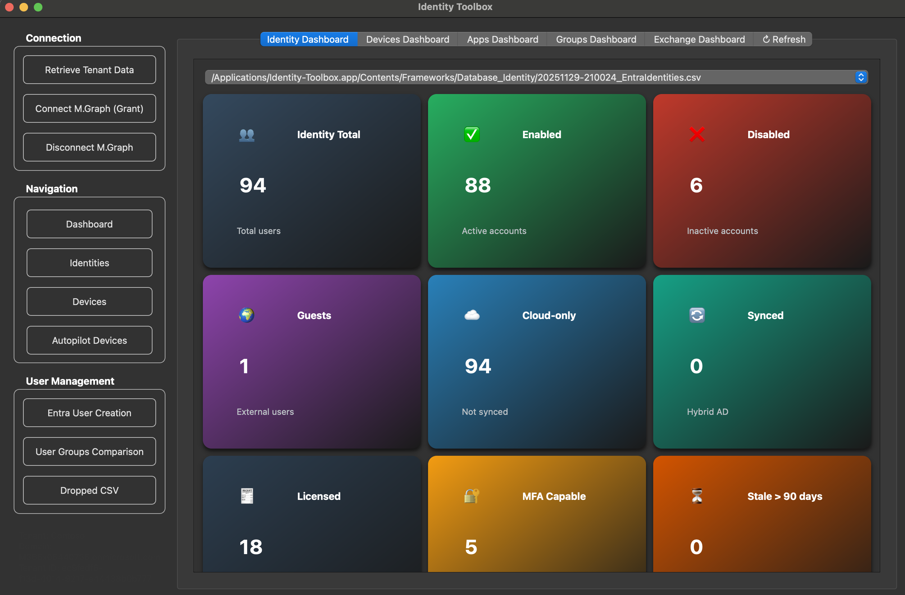
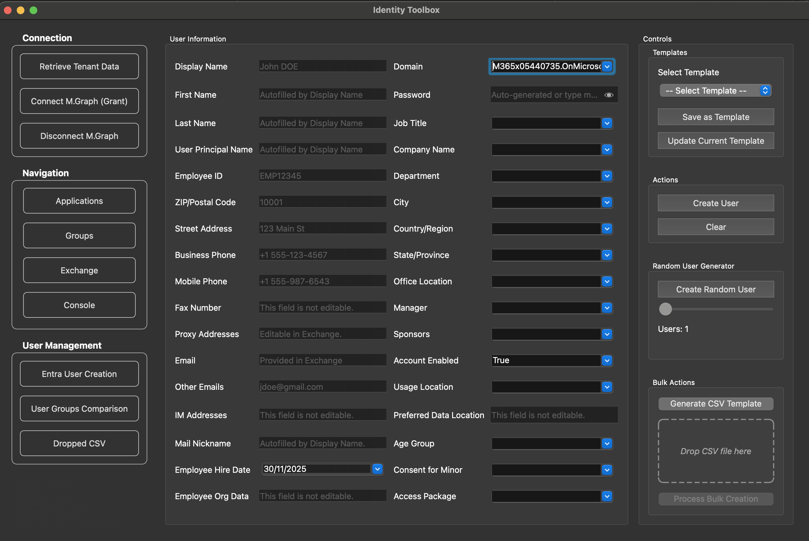
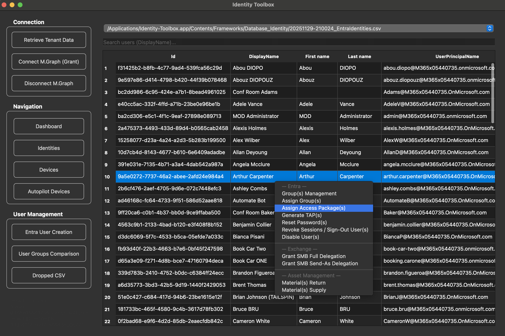
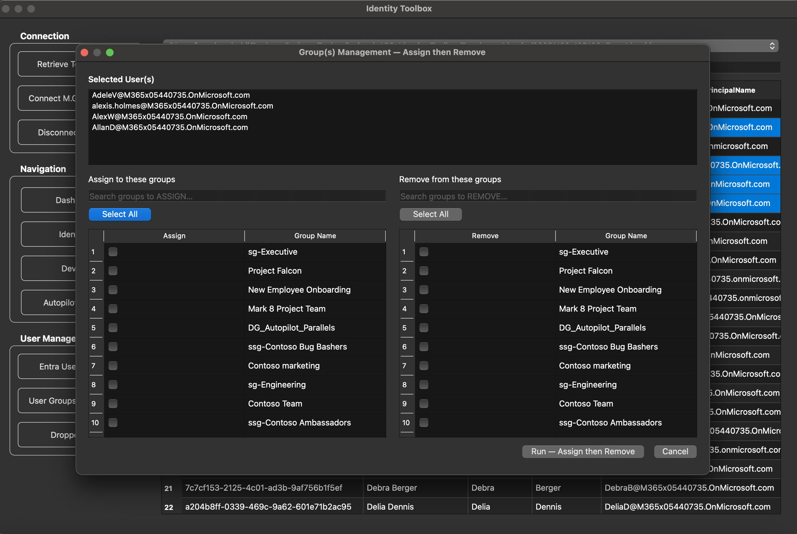
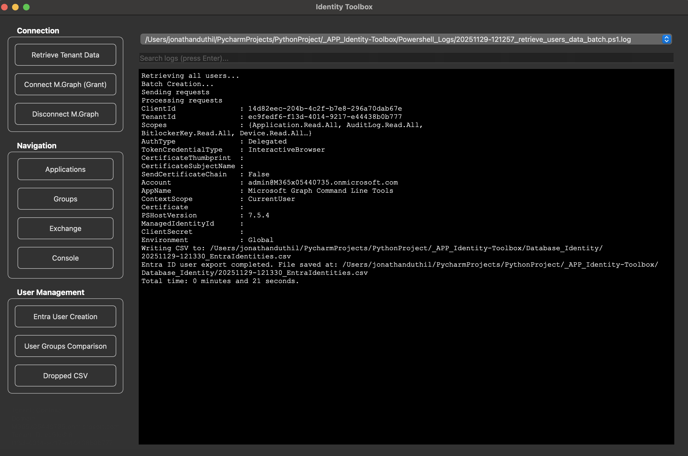

# 🛠️ Identity Toolbox - MacOS

A modern **PyQt6 + PowerShell** desktop app for **Microsoft Entra ID** administration.  
Built for IT admins automating **users, devices, apps, groups & access governance** with a clean UI.

Now includes **Autopilot reporting**, **fast search**, and **advanced AND/OR filtering**.

---

## ✨ Features

### 👤 User Management
- Create & onboard users (GUI or bulk CSV)
- Extended fields (department, company, hire date, usage location, proxies…)
- Fast UPN/email helpers + smart name sanitizing
- Random user generator (Faker)
- **Fast search (starts-with + fallback contains)**
- **Advanced multi-condition filter (Cmd+F / Ctrl+F)**

### 👥 Groups
- Live group explorer & filter
- User-to-user group comparison  
- Assign missing groups instantly  
- Detect & skip **dynamic groups**

### 💻 Devices
- Intune devices export (owner, OS, storage, compliance)
- **Autopilot devices page** ✅  
  - Serial, Model, Group Tag, Enrollment State, Profile Status, Assigned User

### 📦 Access Packages
- List and assign packages
- JSON export for automation workflows

### 🧠 UX & Productivity
- Clickable dashboards per object type
- Real-time PowerShell console output
- Scrollable logs list (shows last 10, scroll for more)
- Auto light/dark theme (macOS optimized)
- Table-aware Advanced Search dialog  
  *(columns auto-match current page)*

---

## 🧩 Data Export Table

> PowerShell scripts auto-save to versioned folders

| Dataset | Script | Output Folder |
|---|---|---|
Users | `retrieve_users_data_batch.ps1` | `Database_Identity/` |
Devices | `retrieve_devices_data_batch.ps1` | `Database_Devices/` |
Apps | `retrieve_apps_data_batch.ps1` | `Database_Apps/` |
Groups | `retrieve_grps_data_batch.ps1` | `Database_Groups/` |
Shared Mailboxes | `retrieve_smbs_data_batch.ps1` | `Database_Exchange/` |
Autopilot Devices | `retrieve_autopilot_devices_data_batch.ps1` | `Database_Autopilot_Devices/` |
Access Packages | `export-entra_accesspackages.ps1` | `JSONs/AccessPackages.json` |

---

## ⚙️ Setup

### Requirements
- Python **3.13+**
- PowerShell **7.5+** (Portable version included)
- Microsoft Graph SDK  
  ```powershell
  Install-Module Microsoft.Graph -Scope AllUsers
  ```

### Run the app
```bash
python id-toolbox.py
```

### 🔑 Microsoft Graph Setup
	1.	Create an App Registration in Entra ID
	2.	Assign delegated permissions:
	3.	Deploy app via Intune Company Portal if required

### 🧪 Example CSV

| Display Name | First name | Last name | User Principal Name     | Password  | Job title  | Company name | Department | Usage location |
|--------------|------------|-----------|-------------------------|-----------|------------|--------------|------------|----------------|
| John Doe     | John       | Doe       | john.doe@contoso.com   | Pass@123  | Engineer   | Contoso      | IT         | FR             |

### ☁️ Graph API Permissions

Required delegated scopes:

```commandline
    "User.Read",
    "Directory.ReadWrite.All",
    "UserAuthenticationMethod.ReadWrite.All",
    "Device.ReadWrite.All",
    "DeviceManagementManagedDevices.Read.All",
    "DeviceLocalCredential.Read.All",
    "BitlockerKey.Read.All",
    "EntitlementManagement.ReadWrite.All",
    "RoleManagement.Read.Directory",
    "Application.Read.All",
    "Policy.Read.All"
```

## 🗺️ Roadmap

| **Feature** | **Status** | **Description** |
|---|:---:|---|
| **Group assignments (Bulk)** | ✅ Done | Assign groups to user(s) |
| **Access Package integration** | ✅ Done | Assign and list Entra ID Access Packages directly via Graph PowerShell |
| **Manager / Sponsor assignment** | ✅ Done | Add Manager and Sponsor attributes during user creation |
| **User group comparison** | ✅ Done | Compare user memberships & assign missing groups |
| **Interactive dashboards** | ✅ Done | Clickable metric cards for Identities, Devices, Apps, Groups |
| **Top tables in dashboards** | ✅ Done | Display “Top Departments”, “Top Countries”, “Top Domains”… |
| **Bulk user creation from CSV (Drop feature)** | ✅ Done | Onboard multiple users at once using drag-and-drop CSV |
| **Fast User Entry window** | ✅ Done | Pre-filled user creation form with smart UPN/email formatter |
| **Random user generator (Faker)** | ✅ Done | Create demo users with realistic data for labs |
| **Dark Mode UI / macOS optimization** | ✅ Done | Smooth dark-mode UI w/ macOS styling |
| **Scrollable Log Dropdown** | ✅ Done | Show only last 10 logs with scroll for history |
| **Fast search (2-field, OR logic)** | ✅ Done | Real-time instant search on DisplayName/UPN |
| **Advanced Search dialog (Cmd/Ctrl+F)** | ✅ Done | Multi-condition AND/OR filter dialog |
| **Autopilot devices module** | ✅ Done | Export and browse Autopilot inventory |
| **Clear Filters button** | ✅ Done | Reset search filters instantly |

| **Dev in progress** | **Status** | **Description** |
|---|:---:|---|
| **Windows packaging (EXE/MSI)** | 🟡 In Progress | Build for Windows admins |
| **Assign User → Autopilot Device** | 🟡 In Progress | Right-click to bind user to HW hash device |

| **Planned** | **Status** | **Description** |
|---|:---:|---|
| **Managed Identity authentication** | 🔜 Planned | No user login — fully automated auth |
| **MFA & TAP reporting** | 🔜 Planned | Export MFA methods & TAP activity |
| **Offline CSV edit → Sync back** | 🔜 Planned | Use CSV offline, sync changes into Entra |
| **Teams & SharePoint reporting** | 🔜 Planned | Expand tooling to collab workloads |
| **Graph batching everywhere** | 🔜 Planned | Maximize speed across all PowerShell exports |

### 📸 Screenshots

|         |     |
|:---------------------------------------------------------:|:-------------------------------------------------------:|
|                    Identity Dashboard                     |                    Groups Dashboard                     |
|  |             |
|                    Entra User Creation                    |                    Identities Table                     |
|     |  |
|                  User Groups Comparison                   |                 Users Groups Comparison                 |
|           |                    |
|                   Retrieve Tenant Data                    |                   Powershell Console                    |


### ⚖️ License
MIT License.
This project is provided as-is for educational and IT administration use.

### 🤝 Contributing
Pull requests are welcome!
For major changes, please open an issue first to discuss what you’d like to change.
