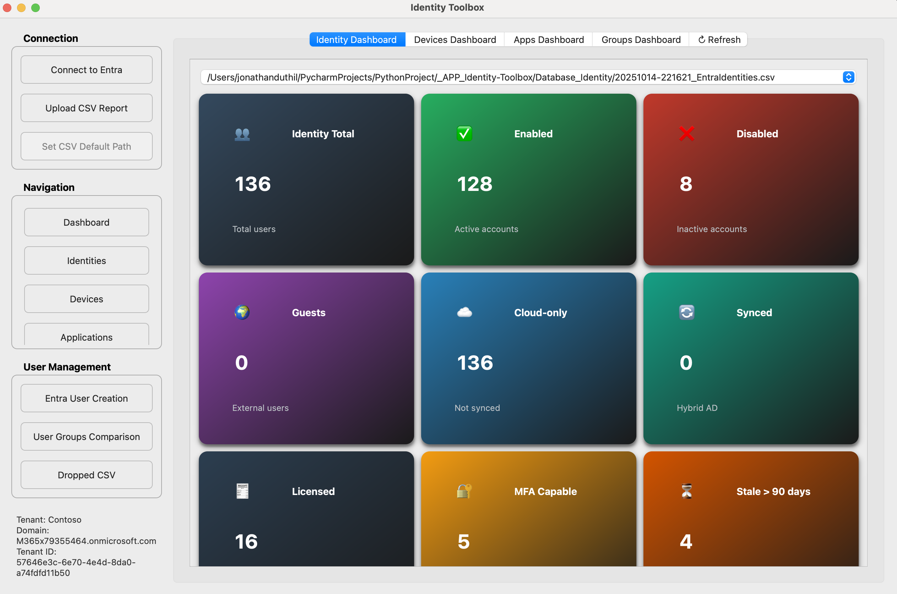
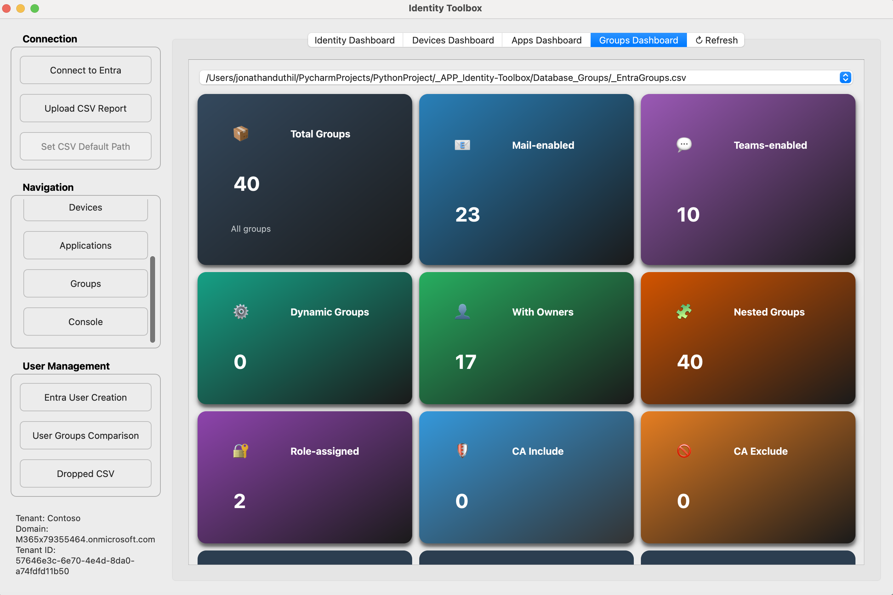
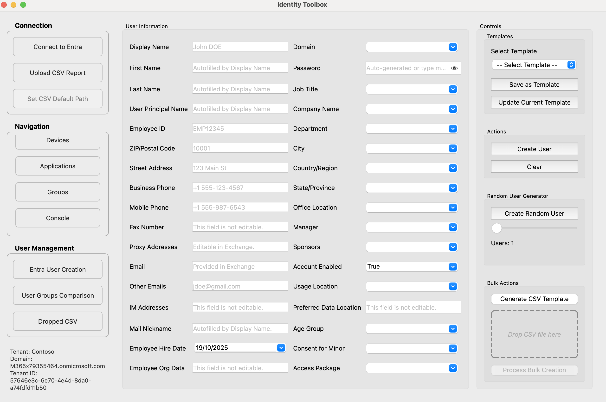
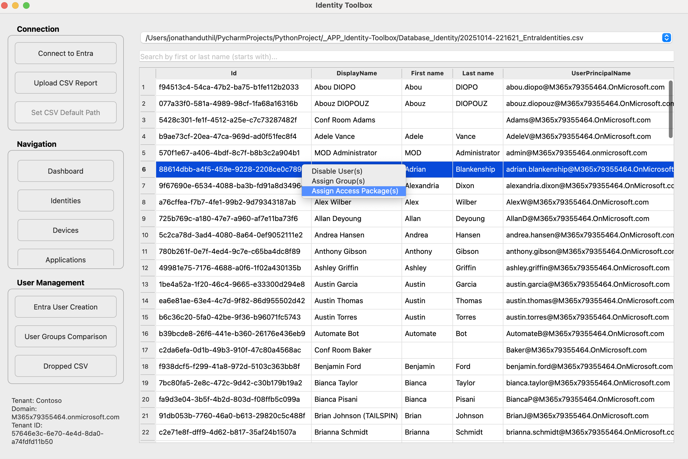
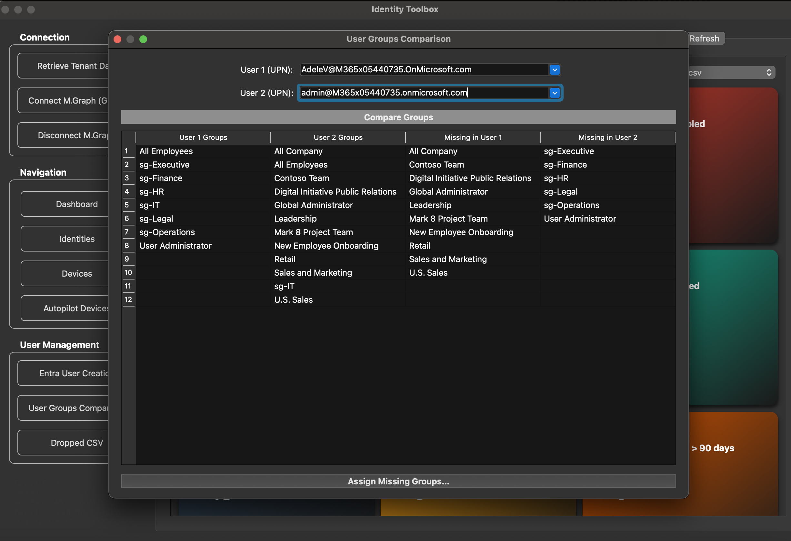
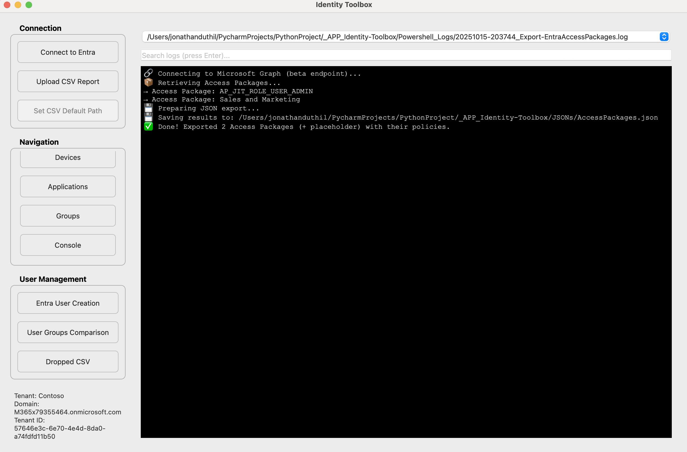

# 🛠️ Identity Toolbox

A modern **PyQt6 + PowerShell** desktop app for **Microsoft Entra ID** administration.  
It gives IT teams clickable dashboards and tools to manage **users, groups, devices, apps, and access packages**—all backed by Microsoft Graph.

---

## ✨ Features

- **👤 Users**
  - Create & onboard users via Microsoft Graph
  - Bulk CSV import/export with built-in templates
  - Extended attributes: Department, Job Title, Company, Hire Date, Usage Location, Age Group, etc.
  - Automatic MailNickname/UPN helpers
  - Random test user generator (Faker)

- **👥 Groups**
  - **User-to-user group comparison** with “Assign Missing Groups…” workflow
  - Assign users to selected groups (CSV-driven list, search & multi-select)
  - Detects dynamic/nested groups; skips dynamic membership safely

- **📦 Access Packages**
  - Browse/search packages and **assign to selected users**
  - Clean progress UI (Assigning… → Results table)

- **📊 Dashboards (clickable cards)**
  - **Identity, Devices, Apps, Groups** dashboards
  - Cards filter their respective tables instantly
  - “Top …” summary tables (departments, domains, models, OS versions, publishers, etc.)

- **⚡ Smooth UX**
  - All PowerShell/Graph calls run in **QThread** workers (no UI freeze)
  - Structured results dialogs with copy/close actions
  - Dark-mode friendly, Mac-optimized styling

- **🚀 Deployment**
  - Packaged for **Intune Company Portal** (macOS first)
  - Works with **App Registration & delegated permissions**

---

## 🖥️ Tech Stack

- **Frontend:** Python (PyQt6)
- **Automation:** PowerShell 7 + Microsoft Graph PowerShell SDK
- **APIs:** Microsoft Graph  
  `User.ReadWrite.All • Directory.ReadWrite.All • Group.ReadWrite.All • EntitlementManagement.ReadWrite.All`
- **Data/Utils:** pandas (CSV), Faker, QThread workers
- **Target platform:** macOS (Windows build planned)

---

## 🚀 Setup

### 1. Prerequisites
- Python 3.13+  
- PowerShell 7.5.2+  
- Microsoft Graph PowerShell SDK (`Install-Module Microsoft.Graph -Scope AllUsers`)  
- Microsoft 365 tenant with admin rights  

### 2. Clone repo
```bash
git clone https://github.com/gelndjj/_APP_Identity-Toolbox.git
cd identity-toolbox
```

### 3. Install dependencies
```bash
pip install -r requirements.txt
```

### 4. Run the app
```bash
python id-toolbox.py
```

### 🔑 Microsoft Graph Setup
	1.	Create an App Registration in Entra ID
	2.	Assign delegated permissions:
	•	User.ReadWrite.All
	•	Directory.ReadWrite.All
	•	EntitlementManagement.ReadWrite.All
	3.	Deploy app via Intune Company Portal if required

### 🧪 Example CSV

| Display Name | First name | Last name | User Principal Name     | Password  | Job title  | Company name | Department | Usage location |
|--------------|------------|-----------|-------------------------|-----------|------------|--------------|------------|----------------|
| John Doe     | John       | Doe       | john.doe@contoso.com   | Pass@123  | Engineer   | Contoso      | IT         | FR             |

## 🗺️ Roadmap

| Feature                                        | Status | Description                                                            |
|------------------------------------------------|:------:|------------------------------------------------------------------------|
| **Group assignments (Bulk)**                   | ✅ Done | Assign groups to user(s)                |
| **Access Package integration**                 | ✅ Done | Assign and list Entra ID Access Packages directly via Graph PowerShell |
| **Manager / Sponsor assignment**               | ✅ Done | Add Manager and Sponsor attributes during user creation                |
| **User group comparison**                      | ✅ Done | Compare group memberships between two users and assign missing groups  |
| **Interactive dashboards**                     | ✅ Done | Clickable metric cards for Identities, Devices, Apps, and Groups       |
| **Top tables in dashboards**                   | ✅ Done | Display “Top Departments”, “Top Countries”, “Top Domains”, etc.        |
| **Bulk user creation from CSV (Drop feature)** | ✅ Done | Onboard multiple users at once using custom templates                  |
| **Fast User Entry window**                     | ✅ Done | Pre-filled user creation form with intelligent UPN/email formatting    |
| **Random user generator (Faker)**              | ✅ Done | Create demo users with realistic data for lab environments             |
| **Dark Mode UI / macOS optimization**          | ✅ Done | Modern aesthetic and responsive layout for macOS                       |
| **Multi-language support (EN/FR/ES)**          | 🟡 In Progress | Localized labels and messages, starting with French                    |
| **Windows packaging (MSI)**                    | 🟡 In Progress | Cross-platform PyInstaller packaging for Windows users                 |
| **Managed Identity authentication**            | 🔜 Planned | Replace delegated auth with App Registration + certificate             |
| **MFA & TAP reporting integration**            | 🔜 Planned | Graph-based insights for MFA methods and Temporary Access Passes       |
| **Offline CSV edit + sync back**               | 🔜 Planned | Edit CSVs offline and push updates back to Entra ID                    |

### 📸 Screenshots

|             |  |
|:-------------------------------------------------------:|:------------------------------------------------:|
|                   Identity Dashboard                    |                 Groups Dashboard                 |
|  |               |
|                   Entra User Creation                   |                 Identities Table                 |
|     |           |
|                 User Groups Comparison                  |                PowerShell Console                |


### ⚖️ License
MIT License.
This project is provided as-is for educational and IT administration use.

### 🤝 Contributing
Pull requests are welcome!
For major changes, please open an issue first to discuss what you’d like to change.
